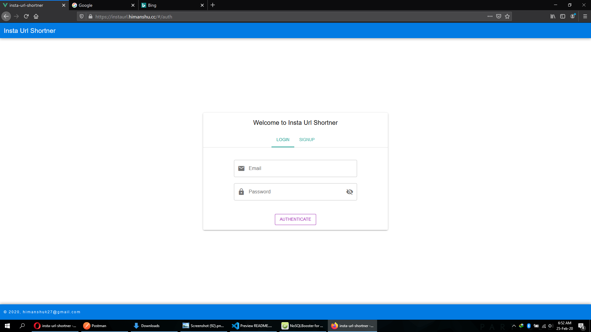
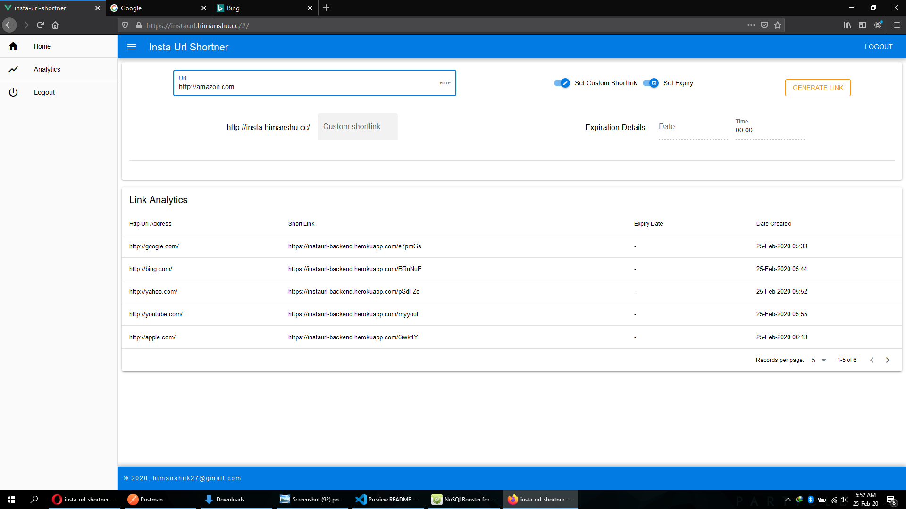
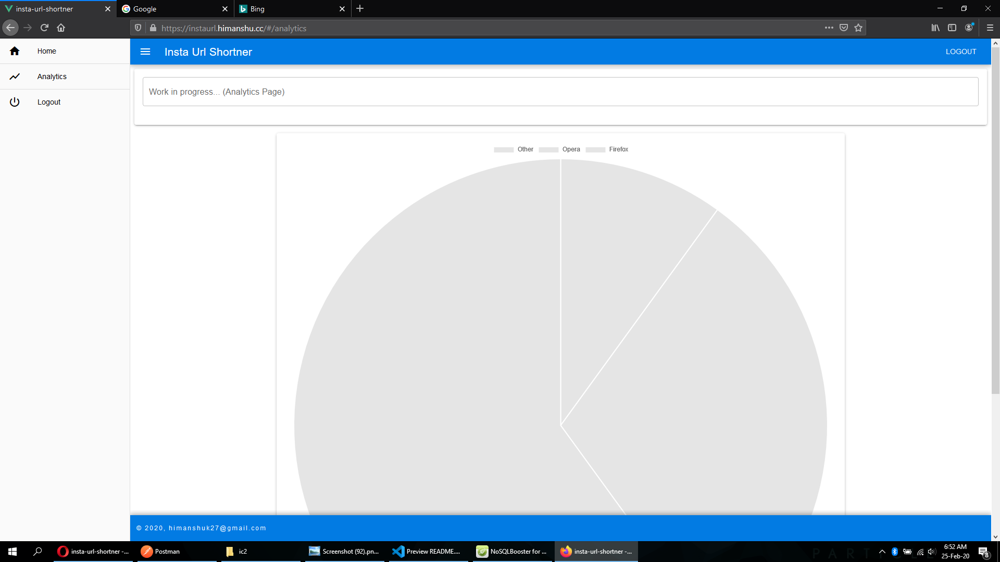

# Insta URL Shortner

[http://instaurl.himanshu.cc](http://instaurl.himanshu.cc)

## App Features

- Instant short link generator
- Fully responsive design
- Webpack optimized
- Set custom link
- Set expiry date and time
- Log user ip address, browser name on link use.
- Browser data analytics animated Charts (see screenshots)

## App Technology Features

- VueJs based frontend
- Express nodejs backend
- Mongodb database
- jest unit test
- cypress e2e test
- full webpack chunking of assets
- Vuex store with encrypted local storage
- JWT Auth token, super secure version using public and private key
- Babel support for latest syntax
- eslint for clean code
- Secure password storage with bcrypt
- Redis Cache
- Redis Rate Limiter
- Xss protection, frameguard for click jacking, ddos protection etc (helmet)
- Unique secure uuids, harder to guess
- Docker container build files (work in progress)
- Backend deployed on heroku
- frontend deployed on aws ec2 instance

## Installation Requirements

- Copy .env.test file to .env
- Install Redis server
  > sudo apt install redis-server
- Npm install
  > npm install

## Build Commands

- Run development frontend server
  > npm run dev
- Run development backend server
  > npm run dev-server
- Run prod backend server
  > npm run build-server &&
  > node lib/server.js
- Run prod fronted server
  > npm run build &&
  > http-server dist
- Run unit test
  > npm run test:unit
- Run end to end test

  > npm run test:e2e

  ## App Directory Structure

  > src - frontend source files
  > src-server- backend source files

  ## ScreenShots

  ### Login Page

  

  ### Main Dashboard

  

  ### Link Analytics

  
